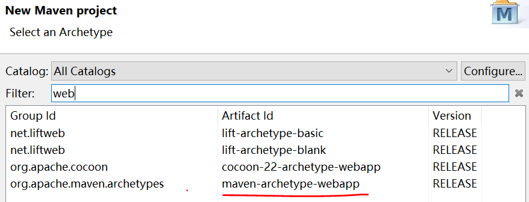
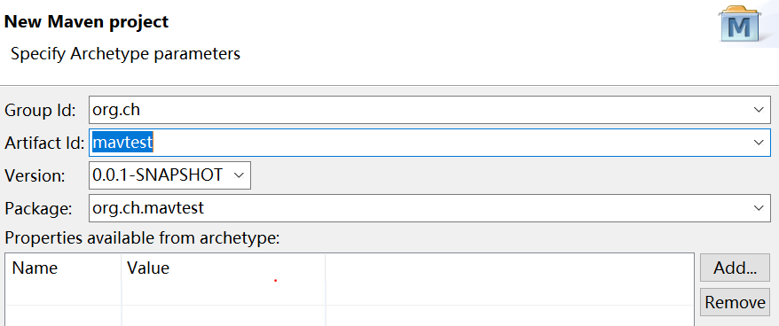
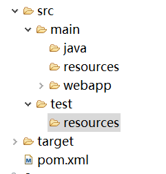

# maven 简介
Maven是一个项目管理和综合工具。Maven提供了开发人员构建一个完整的生命周期框架。开发团队可以自动完成项目的基础工具建设，Maven使用标准的目录结构和默认构建生命周期。

Maven主要目标是提供给开发人员： 
1. 项目是可重复使用，易维护，更容易理解的一个综合模型。 
2. 插件或交互的工具，这种声明性的模式。 

Maven项目的结构和内容在一个XML文件中声明，pom.xml 项目对象模型（POM），这是整个Maven系统的基本单元。

# maven 安装
1. 确保系统中已安装jdk，并配置好环境变量
2. 进入[maven](maven.apache.org/download.cgi "maven官网")官网下载maven，并解压到指定目录
3. 添加 M2\_HOME 和 MAVEN\_HOME 环境变量到 Windows 环境变量，并将其指向你的 Maven 文件夹。其中M2\_HOME必须配置，如果想maven跑的快点，可设置MAVEN_OPTS=-Xms128m -Xmx512m
4. 更新 PATH 变量，添加 Maven bin 文件夹到 PATH 的最后，如： %M2_HOME%\bin, 这样就可以在命令中的任何目录下运行 Maven 命令了。 
5. 执行 mvn –version 进行验证

# maven工程
使用eclipse创建maven web工程

创建步骤如下：




如文件目录结构与图中不符，可补全。

src中，项目的主代码放在main目录，test目录放入测试相关代码

编译出的代码放在target目录下，该目录与src同级

main目录中，java目录存放代码，resources目录下存放配置文件，webapp目录存放web应用相关代码

pom.xml与src和target同级，为maven项目配置文件

# maven 配置文件
settings.xml是maven的全局配置文件。而pom.xml文件是所在项目的局部配置。

maven的配置文件一般在两个地方：
1. 全局配置 {M2_HOME}/conf/settings.xml或者
2. 用户配置 {user.home}

局部配置优先于全局配置。配置优先级从高到低：pom.xml> user settings > global settings

下面是setting.xml的一般属性：
```
<settings xmlns="http://maven.apache.org/SETTINGS/1.0.0"
      xmlns:xsi="http://www.w3.org/2001/XMLSchema-instance"
      xsi:schemaLocation="http://maven.apache.org/SETTINGS/1.0.0
      https://maven.apache.org/xsd/settings-1.0.0.xsd">

  <localRepository/>
  <interactiveMode/>
  <usePluginRegistry/>
  <offline/>
  <pluginGroups/>
  <servers/>
  <mirrors/>
  <proxies/>
  <profiles/>
  <activeProfiles/>

</settings>
```
### maven本地仓库
Maven的本地资源库是用来存储所有项目的依赖关系(插件jar和其他文件，这些文件被Maven下载)到本地文件夹。很简单，当建立一个Maven项目，所有相关文件将被存储在Maven本地仓库。 

默认情况下，Maven的本地资源库默认为 .m2 目录文件夹： 
    
    Unix/Mac OS X – ~/.m2 
    Windows – C:\Documents and Settings\{username}\.m2 

更改Maven的本地库：

      <localRepository>C:/java/.m2/repository</localRepository>
### 用户交互
如果maven需要和用户交互以获得输入，则设置成true，反之则应为false。默认为true。

    <interactiveMode>true</interactiveMode>
### 插件版本管理
如果需要让maven使用文件~/.m2/plugin-registry.xml来管理插件版本，则设为true。默认为false

    <usePluginRegistry>false</usePluginRegistry>
### 离线模式
如果构建系统需要在离线模式下运行，则为true，默认为false。

    <offline>false</offline>
### 插件组
该元素包含一个pluginGroup元素列表，每个子元素包含了一个组织Id（groupId）。

当使用某个插件，并且没有在命令行为其提供组织Id（groupId）的时候，Maven就会使用该列表。默认情况下该列表包含了org.apache.maven.plugins和org.codehaus.mojo

    <pluginGroups>
      <!--plugin的组织Id（groupId） -->
      <pluginGroup>org.codehaus.mojo</pluginGroup>
    </pluginGroups>
### servers
一般情况下，仓库的下载和部署是在pom.xml文件中的repositories和distributionManagement元素中定义的。然而，一般类似用户名、密码（有些仓库访问是需要安全认证的）等信息不应该在pom.xml文件中配置，这些信息可以配置在settings.xml中

    <servers>
      <!--服务器元素包含配置服务器时需要的信息 -->
      <server>
        <!--这是server的id（注意不是用户登陆的id），该id与distributionManagement中repository元素的id相匹配。 -->
        <id>server001</id>
        <!--鉴权用户名。鉴权用户名和鉴权密码表示服务器认证所需要的登录名和密码。 -->
        <username>my_login</username>
        <!--鉴权密码 。鉴权用户名和鉴权密码表示服务器认证所需要的登录名和密码。-->
        <password>my_password</password>
        <!--鉴权时使用的私钥位置。和前两个元素类似，私钥位置和私钥密码指定了一个私钥的路径（默认是${user.home}/.ssh/id_dsa）以及如果需要的话，一个密语。将来passphrase和password元素可能会被提取到外部，但目前它们必须在settings.xml文件以纯文本的形式声明。 -->
        <privateKey>${usr.home}/.ssh/id_dsa</privateKey>
        <!--鉴权时使用的私钥密码。 -->
        <passphrase>some_passphrase</passphrase>
        <!--文件被创建时的权限。如果在部署的时候会创建一个仓库文件或者目录，这时候就可以使用权限（permission）。这两个元素合法的值是一个三位数字，其对应了unix文件系统的权限，如664，或者775。 -->
        <filePermissions>664</filePermissions>
        <!--目录被创建时的权限。 -->
        <directoryPermissions>775</directoryPermissions>
      </server>
    </servers>
### 代理服务器
如果公司正在建立一个防火墙，并使用HTTP代理服务器来阻止用户直接连接到互联网。如果使用代理，Maven将无法下载任何依赖。 

为了使它工作，必须声明在 Maven 的配置文件中设置代理服务器：

    去掉proxies的注释，填写代理服务器的详细信息，即可配置好maven代理服务器。
### profiles
settings.xml中的profile元素是pom.xml中profile元素的裁剪版本。

它包含了id、activation、repositories、pluginRepositories和 properties元素。这里的profile元素只包含这五个子元素是因为这里只关心构建系统这个整体（这正是settings.xml文件的角色定位），而非单独的项目对象模型设置。如果一个settings.xml中的profile被激活，它的值会覆盖任何其它定义在pom.xml中带有相同id的profile

    <profiles>
      <profile>
        <!-- profile的唯一标识 -->
        <id>test</id>
        <!-- 自动触发profile的条件逻辑 -->
        <activation />
        <!-- 扩展属性列表 -->
        <properties />
        <!-- 远程仓库列表 -->
        <repositories />
        <!-- 插件仓库列表 -->
        <pluginRepositories />
      </profile>
    </profiles>

#### activation
activation自动触发profile的条件逻辑。和pom.xml中的profile一样，profile的作用在于它能够在某些特定的环境中自动使用某些特定的值，这些环境通过activation元素指定。

activation元素并不是激活profile的唯一方式。settings.xml文件中的activeProfile元素可以包含profile的id。

    <activation>
      <!--profile默认是否激活的标识 -->
      <activeByDefault>false</activeByDefault>
      <!--当匹配的jdk被检测到，profile被激活。例如，1.4激活JDK1.4，1.4.0_2，而!1.4激活所有版本不是以1.4开头的JDK。 -->
      <jdk>1.5</jdk>
      <!--当匹配的操作系统属性被检测到，profile被激活。os元素可以定义一些操作系统相关的属性。 -->
      <os>
        <!--激活profile的操作系统的名字 -->
        <name>Windows XP</name>
        <!--激活profile的操作系统所属家族(如 'windows') -->
        <family>Windows</family>
        <!--激活profile的操作系统体系结构 -->
        <arch>x86</arch>
        <!--激活profile的操作系统版本 -->
        <version>5.1.2600</version>
      </os>
      <!--如果Maven检测到某一个属性（其值可以在POM中通过${name}引用），其拥有对应的name = 值，Profile就会被激活。如果值字段是空的，那么存在属性名称字段就会激活profile，否则按区分大小写方式匹配属性值字段 -->
      <property>
        <!--激活profile的属性的名称 -->
        <name>mavenVersion</name>
        <!--激活profile的属性的值 -->
        <value>2.0.3</value>
      </property>
      <!--提供一个文件名，通过检测该文件的存在或不存在来激活profile。missing检查文件是否存在，如果不存在则激活profile。另一方面，exists则会检查文件是否存在，如果存在则激活profile。 -->
      <file>
        <!--如果指定的文件存在，则激活profile。 -->
        <exists>${basedir}/file2.properties</exists>
        <!--如果指定的文件不存在，则激活profile。 -->
        <missing>${basedir}/file1.properties</missing>
      </file>
    </activation>
#### properties
maven属性和ant中的属性一样，可以用来存放一些值。这些值可以在pom.xml中的任何地方使用标记${X}来使用，这里X是指属性的名称。属性有五种不同的形式，并且都能在settings.xml文件中访问。

    <!-- 
      1. env.X: 在一个变量前加上"env."的前缀，会返回一个shell环境变量。例如,"env.PATH"指代了$path环境变量（在Windows上是%PATH%）。 
      2. project.x：指代了POM中对应的元素值。例如: <project><version>1.0</version></project>通过${project.version}获得version的值。 
      3. settings.x: 指代了settings.xml中对应元素的值。例如：<settings><offline>false</offline></settings>通过 ${settings.offline}获得offline的值。 
      4. Java System Properties: 所有可通过java.lang.System.getProperties()访问的属性都能在POM中使用该形式访问，例如 ${java.home}。 
      5. x: 在<properties/>元素中，或者外部文件中设置，以${someVar}的形式使用。
    -->
    <properties>
      <user.install>${user.home}/our-project</user.install>
    </properties>
#### Repositories
远程仓库列表，它是maven用来填充构建系统本地仓库所使用的一组远程仓库。

    <repositories>
      <!--包含需要连接到远程仓库的信息 -->
      <repository>
        <!--远程仓库唯一标识 -->
        <id>codehausSnapshots</id>
        <!--远程仓库名称 -->
        <name>Codehaus Snapshots</name>
        <!--如何处理远程仓库里发布版本的下载 -->
        <releases>
          <!--true或者false表示该仓库是否为下载某种类型构件（发布版，快照版）开启。 -->
          <enabled>false</enabled>
          <!--该元素指定更新发生的频率。Maven会比较本地POM和远程POM的时间戳。这里的选项是：always（一直），daily（默认，每日），interval：X（这里X是以分钟为单位的时间间隔），或者never（从不）。 -->
          <updatePolicy>always</updatePolicy>
          <!--当Maven验证构件校验文件失败时该怎么做-ignore（忽略），fail（失败），或者warn（警告）。 -->
          <checksumPolicy>warn</checksumPolicy>
        </releases>
        <!--如何处理远程仓库里快照版本的下载。有了releases和snapshots这两组配置，POM就可以在每个单独的仓库中，为每种类型的构件采取不同的策略。例如，可能有人会决定只为开发目的开启对快照版本下载的支持。参见repositories/repository/releases元素 -->
        <snapshots>
          <enabled />
          <updatePolicy />
          <checksumPolicy />
        </snapshots>
        <!--远程仓库URL，按protocol://hostname/path形式 -->
        <url>http://snapshots.maven.codehaus.org/maven2</url>
        <!--用于定位和排序构件的仓库布局类型-可以是default（默认）或者legacy（遗留）。Maven 2为其仓库提供了一个默认的布局；然而，Maven 1.x有一种不同的布局。我们可以使用该元素指定布局是default（默认）还是legacy（遗留）。 -->
        <layout>default</layout>
      </repository>
    </repositories>
#### pluginRepositories
和repository类似，只是repository是管理jar包依赖的仓库，pluginRepositories则是管理插件的仓库。

maven插件是一种特殊类型的构件。由于这个原因，插件仓库独立于其它仓库。pluginRepositories元素的结构和repositories元素的结构类似。每个pluginRepository元素指定一个Maven可以用来寻找新插件的远程地址

    <pluginRepositories>
      <!-- 包含需要连接到远程插件仓库的信息.参见profiles/profile/repositories/repository元素的说明 -->
      <pluginRepository>
        <releases>
          <enabled />
          <updatePolicy />
          <checksumPolicy />
        </releases>
        <snapshots>
          <enabled />
          <updatePolicy />
          <checksumPolicy />
        </snapshots>
        <id />
        <name />
        <url />
        <layout />
      </pluginRepository>
    </pluginRepositories>
### ActiveProfiles
该元素包含了一组activeProfile元素，每个activeProfile都含有一个profile id。任何在activeProfile中定义的profile id，不论环境设置如何，其对应的 profile都会被激活。如果没有匹配的profile，则什么都不会发生

    <activeProfiles>
      <!-- 要激活的profile id -->
      <activeProfile>env-test</activeProfile>
    </activeProfiles>
### maven中央仓库
当建立一个 Maven 的项目，Maven 会检查你的 pom.xml 文件，以确定哪些依赖下载。首先，Maven 将从本地资源库获得 Maven 的本地资源库依赖资源，如果没有找到，然后把它会从默认的[Maven中央存储库](https://search.maven.org/ "maven中央仓库")查找下载。 

在Maven中，当声明的库不存在于本地存储库中，也不存在于Maven中心储存库，该过程将停止并将错误消息输出到 Maven 控制台

可以添加远程仓库，修改settings.xml：

    <profiles>  
        <id>dev</id> 
        <repositories>
            <repository>
                <id>maven-net-cn</id>  
                <name>Maven China Mirror</name>  
                <url>http://maven.net.cn/content/groups/public/</url>
            </repository>
        </repositories>
    </profiles>  
    <activeProfiles>  
        <activeProfile>dev</activeProfile>  
    </activeProfiles>  

我们定义一个id为dev的profile，将所有repositories以及pluginRepositories元素放到这个profile中，然后，使用\<activeProfiles\>元素自动激活该profile。这样，就不用再为每个POM重复配置仓库。

使用profile为settings.xml添加仓库提供了一种用户全局范围的仓库配置。

至此，Maven的依赖库查询顺序更改为： 
1. 在 Maven 本地资源库中搜索，如果没有找到，进入第 2 步，否则退出。 
2. 在 Maven 中央存储库搜索，如果没有找到，进入第 3 步，否则退出。 
3. 在 maven-net-cn Maven的远程存储库搜索，如果没有找到，提示错误信息，否则退出。 

### 镜像
镜像（mirror）为Maven提供的一个映射机制，来实现远程仓库的切换，使用时要配置该镜像的拦截目标对象，可以是一个或多个，*为全部拦截，被拦截的请求，会从之前的仓库切到该镜像中的仓库地址进行查找获取文件，从而达到切换远程仓库的目的。

    <mirrors>
        <mirror>
            <!--该镜像的id-->
            <id>nexus-aliyun</id>
            <!--该镜像用来取代的远程仓库，central是中央仓库的id-->
            <mirrorOf>central</mirrorOf>
            <name>Nexus aliyun</name>
            <!--该镜像的仓库地址，这里是用的阿里的仓库-->
            <url>http://maven.aliyun.com/nexus/content/groups/public</url>
        </mirror>
    </mirrors>

# pom结构
```
<project xmlns="http://maven.apache.org/POM/4.0.0"
    xmlns:xsi="http://www.w3.org/2001/XMLSchema-instance"
    xsi:schemaLocation="http://maven.apache.org/POM/4.0.0 http://maven.apache.org/maven-v4_0_0.xsd">
    
    <modelVersion>4.0.0</modelVersion>
    
    <groupId>org.ch</groupId>
    <artifactId>maventest</artifactId>
    <packaging>war</packaging>
    <version>0.0.1-SNAPSHOT</version>
    
    <name>maventest Maven Webapp</name>
    <url>http://maven.apache.org</url>
    
    <dependencies>
      <dependency>
        <groupId>junit</groupId>
        <artifactId>junit</artifactId>
        <version>3.8.1</version>
        <scope>test</scope>
      </dependency>
    </dependencies>
    <build>
      <finalName>maventest</finalName>
    </build>
</project>
```

1. modelVersion为pom的版本号，必须有
2. groupId，artifactId，version分别为maven项目的组织名，构建名，版本号，三个合起来为maven仓库中唯一的坐标
3. packaging表示项目打包方式
4. name和url为项目的名称与url，可省略
5. dependecies定义该项目的依赖关系，每一个dependency除了包含maven坐标，还多了一个scope，表示作用域
6. build表示与构建相关的配置
7. 除了项目基本信息外，每个pom.xml都要包含Lifecycle（项目构建的生命周期，包含9个Phase），Plugins，Dependencies

插件拥有别名，例如compile阶段，对应插件为compiler，实际compiler插件为org.apche.maven.plugins:maven-compiler-plugin:2.3.2

每个插件又包括一些goal，例如compiler包括：compiler:helper，compiler:compile等

phase包括：

clean、validate、compile、test、package、verify、install、site、deploy

scope包括：

compile（默认作用域）--编译、测试、运行

test--测试

runtime--测试、运行

provided--编译、测试

system--与provided类似，但依赖与系统资源

# 使用maven命令
可以使用两种不同的方式来执行maven命令
1. mvn<插件>:<目标>[参数]
2. mvn<阶段>

第二种方式使用较多：

    mvn clean--清空输出目录
    mvn compile--编译源代码
    mvn package--生成构建包
    mvn install--将构建包安装到本地仓库
    mvn deploy--将构建包部署到远程仓库
maven命令需要在maven项目的根目录处执行

# maven父子工程

1. 父工程：父工程又称为父控制器，只是一个简单的工程，不能单独运行。作用是将子模块跟子工程聚合在一起。父控制器中的pom.xml配置，在子模块跟子工程中都可以被继承。
2. 子工程：项目中创建的具有业务逻辑并且可以单独部署的的子模块称为子工程，一个项目中不同的子工程通过在pom.xml中添加同一个父工程而整合在一起。
3. 子模块：提取出了一些子工程中通用的模块，做成jar包。当子工程需要使用的时候只要在pom.xml中添加依赖就好了。

父工程创建，在packing部分选择pom，可以将除了pom.xml以外的部分都删除
子模块创建，新建选择New Maven Module Project

构建依赖关系比较简单,假如xxx-web项目需要依赖xxx-service项目,那么打开xxx-web项目中的pom文件，增加依赖

    <dependencies>
      <dependency>
        <groupId>com.xxx</groupId>
        <artifactiId>xxx-service</artifactiId>
        <version>0.0.1-SNAPSHOT</version>
      </dependency>
    </dependencies>

参考：<https://www.yiibai.com/maven/>