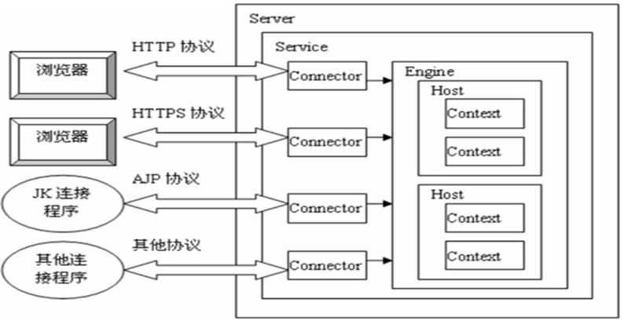

# 简介
tomcat为apach开发的一款sevlet容器，并提供了作为Web服务器的一些特有功能。

## tomcat相关目录

/bin - Tomcat 脚本存放目录（如启动、关闭脚本）。 *.sh 文件用于 Unix 系统； *.bat 文件用于 Windows 系统。
/conf - Tomcat 配置文件目录。
/logs - Tomcat 默认日志目录。
/webapps - webapp 运行的目录。

## web工程目录结构
    |-- webapp                     # 站点根目录
    |-- META-INF                   # META-INF 目录
    |   `-- MANIFEST.MF            # 配置清单文件
    |-- WEB-INF                    # WEB-INF 目录
    |   |-- classes                # class文件目录
    |   |   |-- *.class            # 程序需要的 class 文件
    |   |   `-- *.xml              # 程序需要的 xml 文件
    |   |-- lib                    # 库文件夹
    |   |   `-- *.jar              # 程序需要的 jar 包
    |   `-- web.xml                # Web应用程序的部署描述文件
    |-- <userdir>                  # 自定义的目录
    |-- <userfiles>                # 自定义的资源文件

webapp：工程发布文件夹。其实每个 war 包都可以视为 webapp 的压缩包。

META-INF：META-INF 目录用于存放工程自身相关的一些信息，元文件信息，通常由开发工具，环境自动生成。

WEB-INF：Java web应用的安全目录。所谓安全就是客户端无法访问，只有服务端可以访问的目录。

&nbsp;&nbsp;&nbsp;&nbsp;/WEB-INF/classes：存放程序所需要的所有 Java class 文件。

&nbsp;&nbsp;&nbsp;&nbsp;/WEB-INF/lib：存放程序所需要的所有 jar 文件。

&nbsp;&nbsp;&nbsp;&nbsp;/WEB-INF/web.xml：web 应用的部署配置文件。它是工程中最重要的配置文件，它描述了 servlet 和组成应用的其它组件，以及应用初始化参数、安全管理约束等。

# 安装

## 前提条件
Tomcat 8.5 要求 JDK 版本为 1.7 以上。

进入 [Tomcat](http://tomcat.apache.org/ "tomcat官网") 官方下载地址 选择合适版本下载，并解压到本地。

### Windows
添加环境变量 CATALINA_HOME ，值为 Tomcat 的安装路径。

打开PATH，添加变量值：%CATALINA_HOME%\lib;%CATALINA_HOME%\bin

进入安装目录下的 bin 目录，运行 startup.bat 文件，启动 Tomcat
### Linux / Unix
下面的示例以 8.5.24 版本为例，包含了下载、解压、启动操作。

    # 下载解压到本地
    wget http://mirrors.hust.edu.cn/apache/tomcat/tomcat-8/v8.5.24/bin/apache-tomcat-8.5.24.tar.gz
    tar -zxf apache-tomcat-8.5.24.tar.gz
    # 启动 Tomcat
    ./apache-tomcat-8.5.24/bin/startup.sh
启动后，访问 http://localhost:8080 ，可以看到 Tomcat 安装成功的测试页面。

# tomcat体系结构

# 配置

配置文件位于tomcat根目录下的conf/server.xml文件中。

    <Server>代表整个Servlet容器组件，是最顶层元素，可以包含一个或多个<Service>元素
        <Service>包含一个<Engine>元素以及一个或多个<Connector>元素，这些<Connector>共享一个<Engine>
            <Connector/>代表和客户程序实际交互的组件，负责接收客户请求，以及向客户返回响应
            <Engine>每个<Service>元素只能包含一个<Engine>元素，它处理在同一个<Service>中所有<Connector>接收到的客户请求
                    <Host>在一个<Engine>中可以包含多个<Host>,它代表一个虚拟主机(即一个服务器程序可以部署在多个有不同IP的服务器主机上)，它可以包含一个或多个应用
                            <Context>使用最频繁的元素，代表了运行在虚拟主机上的单个web应用
                    </Host>
            </Engine>
    </Service>
</Server>

下面列举一些主要元素

## server

Server 元素表示整个 Catalina servlet 容器。它是 conf/server.xml 配置文件中的根元素。它的属性代表了整个 servlet 容器的特性。

属性

| 属性 | 描述 | 备注 |
| :-: | :-: | :-: |
| className | 这个类必须实现org.apache.catalina.Server接口 | 默认 org.apache.catalina.core.StandardServer |
| address | 服务器等待关机命令的TCP / IP地址。如果没有指定地址，则使用localhost |  |
| port | 服务器等待关机命令的TCP / IP端口号。设置为-1以禁用关闭端口 |  |
| shutdown | 必须通过TCP / IP连接接收到指定端口号的命令字符串，以关闭Tomcat。 |  |

## Listeners
Server 可以包含几个监听器。一个监听器监听指定事件，并对其作出响应。

JasperListener 作用于 Jasper JSP 引擎，该引擎负责对更新后的 JSP 页面进行重编译。

    <Listener className="org.apache.catalina.core.JasperListener"/>
GlobalResourcesLifecycleListener 作用于全局资源，保证 JNDI 对资源的可达性，比如数据库。

    <Listener className="org.apache.catalina.mbeans.GlobalResourcesLifecycleListener" />

## 全局命名资源
主要用于定义了 JNDI（Java 命名和目录接口）资源，其允许 Java 软件客户端通过名称搜寻和查找数据。

    <GlobalNamingResources>
        <Resource pathname="conf/tomcat-users.xml" factory="org.apache.catalina.users.MemoryUserDatabaseFactory" description="User database that can be updated and saved" type="org.apache.catalina.UserDatabase" auth="Container" name="UserDatabase"/>
    </GlobalNamingResources>
上面的配置定义了一个名称为 UserDatabase 的 JNDI，通过"conf/tomcat-users.xml"得到了一个用于用户授权的内存数据库。
## service
Service元素表示一个或多个连接器组件的组合，这些组件共享一个用于处理传入请求的引擎组件。Server 中可以有多个 Service

属性

| 属性 | 描述 | 备注 |
| :-: | :-: | :-: |
| className | 这个类必须实现org.apache.catalina.Server接口 | 默认 org.apache.catalina.core.StandardServer |
| name | 此服务的显示名称，如果您使用标准 Catalina 组件，将包含在日志消息中。与特定服务器关联的每个服务的名称必须是唯一的 |  |

示例

    <?xml version="1.0" encoding="UTF-8"?>
    <Server port="8080" shutdown="SHUTDOWN">
        <Service name="xxx">
        ...
        </Service>
    </Server>

## Executor

Executor表示可以在Tomcat中的组件之间共享的线程池

属性
| 属性 | 描述 | 备注 |
| :-: | :-: | :-: |
| className | 这个类必须实现org.apache.catalina.Server接口 | 默认 org.apache.catalina.core.StandardServer |
| name | 线程池名称 | 要求唯一, 供Connector元素的executor属性使用 |
| namePrefix | 线程名称前缀 |  |
| maxThreads | 最大活跃线程数 | 默认200 |
| minSpareThreads | 最小活跃线程数 | 默认25 |
| maxIdleTime | 当前活跃线程大于minSpareThreads时,空闲线程关闭的等待最大时间 | 默认60000ms |
| maxQueueSize | 线程池满情况下的请求排队大小 | 默认Integer.MAX_VALUE |

示例

    <Service name="xxx">
        <Executor name="tomcatThreadPool" namePrefix="catalina-exec-" maxThreads="300" minSpareThreads="25"/>
    </Service>

## connector
Connector代表连接组件。Tomcat 支持三种协议：HTTP/1.1、HTTP/2.0、AJP

属性
| 属性 | 描述 | 备注 |
| :-: | :-: | :-: |
| asyncTimeout | Servlet3.0规范中的异步请求超时 | 默认30s |
| port | 请求连接的TCP Port | 设置为0,则会随机选取一个未占用的端口号 |
| protocol | 协议. 一般情况下设置为 HTTP/1.1,这种情况下连接模型会在NIO和APR/native中自动根据配置选择 |  |
| URIEncoding | 对URI的编码方式 | 如果设置系统变量org.apache.catalina.STRICT_SERVLET_COMPLIANCE为true,使用 ISO-8859-1编码;如果未设置此系统变量且未设置此属性, 使用UTF-8编码 |
| useBodyEncodingForURI | 是否采用指定的contentType而不是URIEncoding来编码URI中的请求参数 |  |

## Context

Context元素表示一个Web应用程序，它在特定的虚拟主机中运行。每个Web应用程序都基于Web应用程序存档（WAR）文件，或者包含相应的解包内容的相应目录。

属性
| 属性 | 描述 | 备注 |
| :-: | :-: | :-: |
| altDDName | web.xml部署描述符路径 | 默认 /WEB-INF/web.xml |
| docBase | Context的Root路径 | 和Host的appBase相结合, 可确定web应用的实际目录 |
| failCtxIfServletStartFails | 同Host中的failCtxIfServletStartFails, 只对当前Context有效 | 默认为false |
| logEffectiveWebXml | 是否日志打印web.xml内容(web.xml由默认的web.xml和应用中的web.xml组成 | 如果设置系统变量org.apache.catalina.STRICT_SERVLET_COMPLIANCE为true,使用 ISO-8859-1编码;如果未设置此系统变量且未设置此属性, 使用UTF-8编码 | 默认为false |
| path | web应用的context path | 如果为根路径,则配置为空字符串(""), 不能不配置 |
| privileged | 是否使用Tomcat提供的manager servlet | |
| reloadable | /WEB-INF/classes/ 和/WEB-INF/lib/ 目录中class文件发生变化是否自动重新加载 | 默认为false |
| swallowOutput | true情况下, System.out和System.err输出将被定向到web应用日志中 | 默认为false |

## Engine

Engine元素表示与特定的Catalina服务相关联的整个请求处理机器。它接收并处理来自一个或多个连接器的所有请求，并将完成的响应返回给连接器，以便最终传输回客户端。

| 属性 | 描述 | 备注 |
| :-: | :-: | :-: |
| defaultHost | 默认主机名，用于标识将处理指向此服务器上主机名称但未在此配置文件中配置的请求的主机 | 这个名字必须匹配其中一个嵌套的主机元素的名字属性 |
| name | 此引擎的逻辑名称，用于日志和错误消息 | 在同一服务器中使用多个服务元素时，每个引擎必须分配一个唯一的名称 |

## host

Host元素表示一个虚拟主机，它是一个服务器的网络名称（如“www.baidu.com”）与运行Tomcat的特定服务器的关联。

| 属性 | 描述 | 备注 |
| :-: | :-: | :-: |
| name | 名称 | 用于日志输出 |
| appBase | 虚拟主机对应的应用基础路径 | |
| createDirs | 当appBase和xmlBase不存在时,是否创建目录 | 默认为true |
| autoDeploy | 是否周期性的检查appBase和xmlBase并deploy web应用和context描述符 | 默认为true |
| deployIgnore | 忽略deploy的正则 | 默认为true |
| deployOnStartup | Tomcat启动时是否自动deploy | 默认为true |
| failCtxIfServletStartFails | 配置为true情况下,任何load-on-startup >=0的servlet启动失败,则其对应的Contxt也启动失败 | 默认为true |

## Valve
Valve（阀门）作为请求的前置处理程序，可以在请求发送到应用之前拦截 HTTP 请求。可以定义在任何容器中，比如 Engine、Host、Context和 Cluster。默认配置中，AccessLogValve 会拦截 HTTP 请求，并在日志文件中创建一个日志切入点，如下：

    <Valve className="org.apache.catalina.valves.AccessLogValve" pattern="%h %l %u %t "%r" %s %b" suffix=".txt" prefix="localhost_access_log." directory="logs"/>
# 部署方式
## 本地部署
这种方式要求本地必须安装 Tomcat 。

将打包好的 war 包放在 Tomcat 安装目录下的 webapps 目录下，然后在 bin 目录下执行 startup.bat 或 startup.sh ，Tomcat 会自动解压 webapps 目录下的 war 包。

成功后，可以访问 http://localhost:8080/xxx （xxx 是 war 包文件名）。
## 修改conf/server.xml

1. 打开tomcat下conf/server.xml，在`<Host> </Host>`标签之间输入项目配置信息

    <Context path="/WebProject" docBase="D:/WebProject" reloadable="true" />
2. 启动tomcat
## 配置文件部署

1. 进入到 apache-tomcat\conf\Catalina\localhost\ 目录，新建一个 项目名.xml 文件
2. 在新建的 xml 文件中，增加下面配置语句（和上面的是一样的,但是不需要 path 配置，加上也没什么用）
        
        <Context docBase="D:/WebProject" reloadable="true" />

## 三种部署方式比较
1. 第一种方法比较普通，但是我们需要将编译好的项目重新 copy 到 webapps 目录下，多出了两步操作
2. 第二种方法直接在 server.xml 文件中配置，但是从 tomcat5.0版本开始后，server.xml 文件作为 tomcat 启动的主要配置文件，一旦 tomcat 启动后，便不会再读取这个文件，因此无法再 tomcat 服务启动后发布 web 项目
3. 第三种方法是最好的，每个项目分开配置，tomcat 将以\conf\Catalina\localhost 目录下的 xml 文件的文件名作为 web 应用的上下文路径，而不再理会 <Context>中配置的 path 路径，因此在配置的时候，可以不写 path。
通常我们使用第三种方法

从Tomcat6开始，Tomcat支持自动映射，即tomcat服务器会自动管理webapps目录下的所有web应用，并把它映射成虚拟目录，换句话说，只需把web应用放在webapps目录下，不需要配置Context，外界可以直接访问

但是如果不想将项目放在webapps下，而是放在其他地方，还是需要配置Context。

tomcat在加载一个web应用时，会一次按照以下五种方式查找web应用中的<Context>元素，优先级一次降低，直到找到为止
1. 到Tomcat安装目录/conf/Context.xml文件中查找<Context>元素。
2. 到Tomcat安装目录/conf/[enginename]/[hostname]/context.xml.default文件中查找<Context>元素。
   [enginename]:表示<Engine>的name属性
   [hostname]:表示<Host>d的那么属性
3. 到Tomcat安装目录/conf/[enginename]/[hostname]/[contextpath].xml文件中查找<Context>元素
   [contextpath]:表示单个Web应用的URL入口
4. 到Web应用的META-INF/context.xml文件中查找<Context>元素
5. 到Tomcat安装目录/conf/server.xml文件中查找<Context>元素。只适用于单个Web应用

# 配置数据源
从tomcat 5.5开始，tomcat内置了DBCP的数据源实现，可以非常方便的配置DBCP数据源。

Tomcat提供了两种配置数据源的方式，一种是全局数据源，可以让所有的web应用都能访问；一种是局部数据源，只能让单个数据源访问。

不管配置那种数据源，都需要提供特定数据库的JDBC驱动程序，将它复制到Tomcat的lib路径下。例如将MySQL的JDBC驱动程序复制到lib路径下 

局部数据源无需修改系统的配置文件，只需用户修改自己的Web部署文件，不会造成系统的混乱，而且数据源被封装在一个Web应用之内，防止被其他应用访问，提供了良好的封装性。例如修改webproject.xml文件。为Context元素增加一个子元素Resource，文件内容如下：

    <Context docBase="D:/data/webdemo" path="/webdemo" debug="0"  reloadable="true">
        <Resource name="jdbc/mydb"
                  auth="Container"
                  type="javax.sql.DataSource"
                  maxActive="100"
                  maxIdle="30"
                  maxWait="10000"
                  username="root"
                  password="root"
                 driverClassName="org.jdbc.mysql.Driver"
                 url="jdbc:mysql://localhost:3306/mydb"/>
    </Context>

# 启动

## IDE
主要以eclipse配置tomcat为例：
1. 打开Eclipse，单击window菜单，选择下方的Preferences。
2. 搜索server标签，选择runtime environment，添加按钮
3. 配置tomcat的路径
4. 配置jdk
5. 在eclipse的server标签中，添加tomcat，之后便能发布服务了

双击上图中server面板的tomcat容器，可修改tomcat配置，如任务启动最大等待时间等。

Server Locations配置有三个选项：

    1. Use workspace metadata (does not modify Tomcat installation);
    2. Use Tomcat installation (take control of Tomcat Installation);
    3. Use Custom location (does not modify Tomcat installation);
    下面还有两个配置：
    1. Server path(即tomcat或者eclipse根目录)
    2. Deploy path(工程文件的根目录，tomcat一般为webapps，workspace下一般为wtpwebapps)

第一个选项表示使用当前workspace的metadata路径，它一般会将输出文件保存至workspace目录下。第二个表示输出文件保存至tomcat安装目录下。如果需要修改此配置，需先将tomcat服务下的工程全部移除(remove all)，右键点击 clean命令，最后才能修改此项配置。

## 使用 maven 插件启动（不推荐）
不推荐理由：这种方式启动 maven 虽然最简单，但是有一个很大的问题是，真的很久很久没发布新版本了
## 嵌入式
暂不使用